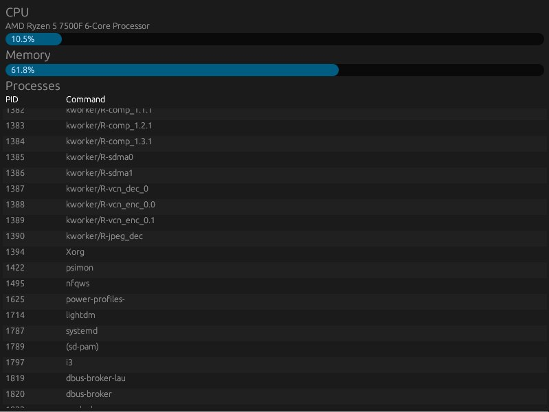

# top-rs - Linux System Monitor in Rust with egui

Lighweight, real-time system monitor inspired by `htop`, built with Rust and egui.



## Features:
- Real-time memory usage() 
- Real-time CPU usage (calculated from `/proc/stat`)
- List of running processes with PID and command
- Native GUI with `egui`

## Requirements:
- Linux (any modern distribution)
- Rust 1.70+

## Installation & Run:
```
git clone git@github.com:dalKonstantin/top-rs.git
cd top-rs

cargo run
```


## TODO:
- Add memory/CPU graphs and history
- Processes sorting by CPU/Memory
